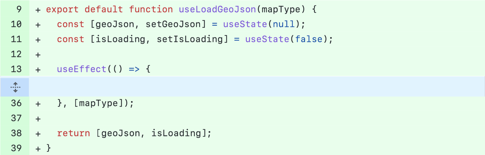
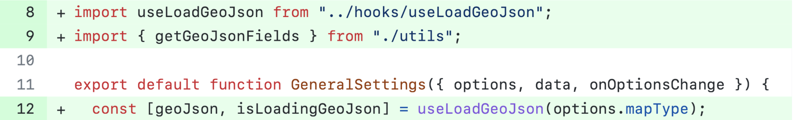
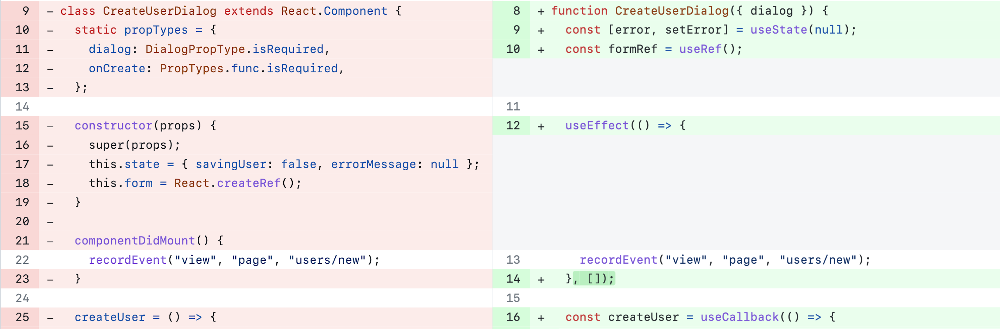

# Catalog of common refactorings performed in React-based Web apps

<div align="justify">
 
## Table of Contents

* __[Introduction](#introduction)__
* __[Catalog of *React* Refactorings](#catalog-of-react-refactorings)__
  * [*React*-specific Refactorings](#react-specific-refactorings)
  * [React-adapted Refactorings](#react-adapted-refactorings)
  * [JavaScript Refactorings](#javascript-refactorings)
  * [Traditional Refactorings](#traditional-refactorings)
* __[About](__about)__

  
## Introduction 

Refactoring is a well-known technique to improve software quality. However, there are still relevant domains where refactoring has not been studied in-depth, such as JavaScript front-end frameworks. Essentially, such frameworks provide abstractions—called components—for structuring and organizing the codebase of modern and responsive Web UIs. Since these UIs can reach hundreds of components, it is natural to expect that suboptimal design decisions will eventually occur in their development. Therefore, information and documentation on the refactorings performed in these components have a practical value for practitioners nowadays, particularly for front-end developers.

To fill this gap, we empirically study refactorings that developers perform when maintaining and evolving *React*-based Web applications. By manually inspecting 320 refactoring commits performed in open source projects, we catalog 69 distinct refactoring operations of which 25 are specific to *React* code, 17 are adaptations of traditional refactorings for the *React* context, 22 are traditional refactorings, and six are specific to JavaScript and CSS code. The catalog of refactorings proposed in this article migth support practitioners when improving the maintainability of *React* applications.

Please feel free to make pull requests and suggestions ([Issues][Issues] tab). We want to hear from you!

## Catalog of *React* Refactorings

In the following sections, we discuss the most frequent refactorings that developers perform when maintaining and evolving *React*-based Web applications. To ease their presentation and understanding, we classified these refactoring instances into four major categories: 

* *React*-specific refactorings, which are novel refactorings that only occur in front-end code that uses *React*.

* *React*-adapted refactorings, which are refactorings that although related to the *React* context can be seen as adaptations of traditional refactorings. 

* Traditional refactorings, i.e., refactorings documented in Fowler’s catalog).

* JavaScript and CSS refactorings, which are refactorings related to JavaScript and CSS code and structures and that were not previously classified as *React*-specific or *React*-adapted refactorings.

The following table summarizes the number of distinct refactoring operations we found by category and the number of occurrences.

Category | Number of Refactorings | Occurrences 
| :--- | :---: | :---:
[*React*-specific refactorings](#react-specific-refactorings)  | 25 | 134
[*React*-adapted refactorings](#react-adapted-refactorings)  | 17 | 214
[Traditional refactorings](#traditional-refactorings)  | 22 | 192
[JavaScript-specific refactorings](#javascript-refactorings)  | 6 | 22

### *React*-specific Refactorings

We found 25 novel refactorings that only occur in front-end code that uses React. In the following table, we summarize the *React*-specific refactorings operations and the instances of each one.

Refactoring | Occurrences | Projects
| :--- | :---: | :---:
[Extract logic to a custom hook](#extract-logic-to-a-custom-hook) | 47 | 8
[Migrate class component to function component](#migrate-class-component-to-function-component) | 33 | 7
[Migrate Angular to React Component](#migrate-angular-to-react-component) | 7 | 2
[Replace third-party component with own component](#replace-third-party-component-with-own-component) | 5 | 2
[Extract conditional in render](#extract-conditional-in-render) | 4 | 2
[Remove props in initial state](#remove-props-in-initial-state) | 4 | 4
[Migrated to styled component](#migrated-to-styled-component) | 4 | 2
[Memoize component](#memoize-component) | 3 | 3
[Extract higher-order component (HOC)](#extract-higher-order-component-(HOC)) | 3 | 2
[Remove direct DOM manipulation](#remove-direct-dom-manipulation) | 3 | 2
[Replace access state in ``setState`` with callbacks](#replace-access-state-in-setstate-with-callbacks) | 3 | 2
[Replace direct mutation of state with ``setState()``](#replace-direct-mutation-of-state-with-setstate) | 3 | 1
[Replace logic to hook](#replace-logic-to-hook) | 2 | 1
[Remove ``forceUpdatte()``](#remove-forceupdatte) | 2 | 1


#### Extract logic to a custom hook

By default, *React* provides hooks to use state and other *React* features without writing a class. For example, the ``useState()`` hook allows tracking state in function components. However, the logic that deals with state might also become duplicated in components. For example, in a chat application, more than one component may store data on the status of the users. Moreover, these components may also replicate the logic that checks whether a user is online or not. *React Hooks* allows eliminating this duplicated logic by extracting it to a custom hook, which is a function whose name starts with ``use`` (e.g., ``useFriendStatus``). This hook usually returns the state and the function to update it (e.g., ```const [friendStatus, setFriendStatus] = useFriendStatus();``` ). 

> **Problem:** The logic that deals with state might also become duplicated in components.
>  
> **Solution:** Eliminating the duplicated logic by extracting it to a custom hook.
>  
> **Example:** several components in the ``Redash`` project need to load geolocation data and add it to the ``geoJson`` components state. Initially, each component had its geolocation state and the loading. Then, a refactoring was performed to extract the state and the associated logic to a single custom hook, called ``useLoadGeoJson``, as illustrated in the following figure. We found 47 occurrences of this refactoring.
   
  <figure>
    <br>
    <figcaption align="center">(a) useLoadGeoJson custom hook</figcaption><br>
  </figure>
  <br>
  <figure>
    <br>
    <figcaption align="center">(b) The component GeneralSettings using the useLoadGeoJson hook</figcaption>
  </figure>

<br />
<br />

> **Benefits:** Custom hooks improve reusability since the same code across multiple components is implemented in a single function.  
>
> **Liabilities:** Developers familiar with object-oriented programming paradigm typically find it easier to deal with state and lifecycle methods using Class components.

We found 47 occurrences of this refactoring.
 
#### Migrate class component to function component

*React* supports class and function components. A class component is an ES6 class with local state, lifecycle control methods (e.g., ``componentDidMount()`` and ``componentDidUpdate()``) and a render method that returns what must appear in the UI. On the other hand, a function component is just a JavaScript function that accepts props (or inputs) as arguments and returns a *React* element representing the UI. For this reason, function components are simpler to understand than class components. Moreover, by using hooks, function components can access state and other *React* features

> **Problem:** Class components are deprecated and the official *React* documentation recommends the use of function components in new codebases.
>
> **Solution:** Convert class component into function component.
>
> **Example:** The following figure shows an example that replaces the ``CreateUserDialog`` class with a function component. Specifically, the refactoring (1) changes the class to a function, (2) removes the ``render`` method, (3) removes references to ``this``, (4) removes the constructor and replaces the state with a ``useState`` hook, (5) replaces the ``componentDidMount()`` lifecycle method with a ``useEffect`` hook.

<figure>

  <figcaption>Refactoring CreateUserDialog class component to function component</figcaption>
</figure>

<br />
<br />

> **Benefits:** Functional components are simpler and less verbose than class components. Consequently, they are easier to read, write, reuse, and test. 
>
> **Liabilities:** Developers familiar with object-oriented programming paradigm  typically find it easier to grasp using Class components.

Replacing class components with function components is a common *React*-specific refactoring, with 33 occurrences in our dataset.

#### Migrate Angular to React Component

This refactoring operation transforms a component developed using the Angular framework into a *React* component. Therefore, it is commonly performed when developers migrate an Angular-based application to a \textsc{React}-based one. 

> **Problem:** The development team opts for a gradual migration from the legacy front-end framework to *React*. Consequently, both legacy code and sections utilizing the new framework coexist within the codebase. 
> 
> **Solution:** Migrate legacy code to *React*.
> 
> In our analysis, we identified seven instances of this refactoring operation in two projects that underwent a migration from *Angular* to *React*.

#### Replace third-party component with own component

Developers can use components from a component library while developing a *React* Web App. This refactoring replaces a third-party component with an in-house component developed by the team. 

> **Problem:** Employing third-party solutions entails limitations, including reduced flexibility and the risk of breaking changes.
> 
> **Solution:** Replace a third-party component with an in-house component developed by the team.
> 
> **Liabilities:** Third-party components can improve the efficiency of the app development process and reduce app development costs significantly.

We found five occurrences of this refactoring.

#### Extract conditional in render

*React* allows conditional rendering of UI elements using JavaScript syntax like ```if``` statements, ```&&```, and ```? :``` operators, depending on the application's state—for example, a set of UI elements is rendered only when the user is logged in. This refactoring extracts conditional rendering.

> **Problem:** Mixing JSX code with nested conditional rendering makes the code hard to read and maintain. 
>
> **Solution:** Extract the conditional rendering.

In our dataset, we found four refactorings that simplify such conditionals by extracting the JSX code to other components or helper methods.


### React-adapted Refactorings

In our analysis, we found seven refactorings that, although related to the *React* context, are adaptations of traditional refactorings. For this reason, we call them as *React*-adapted refactorings. In the following table, we summarize such refactorings and highlights the traditional refactoring they are similar to.

Refactoring | Similar to | Occurrences | Projects
| :--- | :--- | :---: | :---:
[Extract component](#extract-component) | Extract Class | 76 | 10
[Rename component](#rename-component) | Rename Class | 30 | 7
[Move Component](#move-component) | Move Class | 24 | 7
[Remove unused props ](#remove-unused-props) | Remove unused parameter | 24 | 6
[Rename prop](#rename-props) | Rename field | 12 | 4
[Split component ](#split-component) | Extract Class | 9 | 4
[Move Hook ](#move-hook) | Move Method | 8 | 2
[Extract HTML/JS code to component ](#extract-htmljs-code-to-component) | Extract Class | 7 | 4
[Extract JSX outside render method to component ](#extract-jsx-outside-render-method-to-component) | Extract Class | 6 | 5
[Rename hook ](#rename-hooks) | Rename Method | 6 | 3
[Combine Components into one](#combine-components-into-one) | Combine Functions into Class | 3 | 3
[Remove unused state ](#remove-unused-state) | Remove unused field | 3 | 2] 
[Rename state ](#rename-state) | Rename Variable | 2 | 1

#### Extract component

This refactoring occurs when parts of a component appear in multiple places. Therefore, extracting these parts into a new component allows their reuse in other places. 

> **Problem:** Certain elements of a component are replicated across multiple components, resulting in duplicated code.

> **Solution:** Move this code to a separate component and replace the old code with a call to the new component. 

> **Benefits:** Consolidating duplicated code into a separate component promotes reusability, enhances code readability, and simplifies maintenance efforts.

> **Liabilities:** This solution might introduce complexities in integrating the new component managing dependencies, potentially requiring additional refactoring efforts across the codebase, which could temporarily impact development workflows.

We found 76 occurrences of this refactoring in our dataset.

#### Rename component

This refactoring  usually occurs when the name of a component does not represent the component well, either because the component was poorly named or because its purpose evolved and the original name finished being a good choice.

> **Problem:** The name of a component does not represent the component well. 

> **Solution:** Rename the component.

> **Benefits**: Code readability. 

We found 30 refactorings that rename components. 

#### Move component

This refactoring is recommended when a component is used in multiple files. In such cases, we should consider moving the component to the location where it is most used. 

> **Problem:** A component is used more in another file than in its own file.

> **Solution:** Move the component to where it is more used.

> **Benefits:** Centralizing the component where it is predominantly used enhances organization, readability, and functionality within the codebase.

We found 24 occurrences of this refactoring.

#### Split Component

This refactoring occurs when a component starts getting too large, with many responsibilities, making it hard to maintain. 

> **Problem:** A component too large, with many responsibilities.

> **Solution:** Create new components, dividing the large component into smaller and more manageable parts. 

> **Benefits:** Improve maintainability, readability, and scalability through component segmentation.

> **Liabilities:** This can increase the complexity of component communication.


We found nine occurrences of this refactoring in our dataset.

#### Move hook

This refactoring is recommended when a hook is used in multiple components. In such cases, we should consider moving the hook to the location where it is most used. 

> **Problem:** A hook is used more in another file (or component) than in its own file (or component).

> **Solution:** Move the hook to where it is more used.

> **Benefits:** Centralizing the hook where it is predominantly used enhances organization, readability, and functionality within the codebase.

We found eight occurrences of this refactoring.

#### Rename prop

This refactoring is similar to a traditional rename refactoring. It occurs when the name of a prop does not represent its purpose very well. We found seven occurrences of this refactoring.

> **Problem:** The name of a prop does not represent its purpose very well. 

> **Solution:** Rename the prop.

> **Benefits**: Code readability. 

We found 12 refactorings that rename components. 

#### Rename hook

This refactoring is also similar to a traditional rename refactoring. It occurs when the name of a hook does not represent its purpose well. 

> **Problem:** The name of a hook does not represent its purpose very well.  

> **Solution:** Rename the hook.

> **Benefits**: Code readability. 

We found six occurrences of this refactoring.


### JavaScript Refactorings

As described in the following table, we found ten instances of five refactoring operations specific to JavaScript, i.e., they are not directly related to *React*-specific code. For example, the most common refactoring is ``Convert JavaScript Code into TypeScript``, with four occurrences.

Refactoring | Type | Occurrences | Projects |
| :--- | :---: | :---: | :---:
Convert JS code in TS | JS | 13 | 5
Migrate function to arrow function syntax JS | 4 | 2
Replace promises with useCallBack  | JS | 1 | 1
Replace EOL to semi-colon format | JS | 1| 1
Rename CSS Class | CSS | 2 | 2
Extract Stylesheet | CSS | 1 | 1

### Traditional Refactorings
  
We also found 74 instances of 16 refactoring operations documented in Fowler’s catalog. ``Dead Code Elimination`` is the most common one, with 27 occurrences, followed by ``Extract Method``, with nine occurrences.

Refactoring | Occurrences | Projects
| :--- | :---: | :---:
Dead Code Elimination  | 83 | 9
Move Function  | 20 | 6
Extract Function  | 16 | 5
Rename Function  | 13 | 3
Consolidate Conditional Expression  | 11 | 5
Duplicated Code Elimination  | 7 | 4
Rename Method  | 6 | 4
Rename Variable  | 6 | 3
Extract Method  | 4 | 3
Rename Type  | 4 | 2
Rename Parameter  | 4 | 2
Move File  | 3 | 3
Rename File  | 3 | 2
Rename Object Fields  | 2 | 2
Move Type Definition  | 2 | 1
Replace magic literal  | 2 | 2
Merge Methods  | 1 | 1
Move Method  | 1 | 1
Rename Interface  | 1 | 1
Encapsulate fields in Object  | 1 | 1
Replace custom logic with external lib  | 1 | 1
Use Composition instead of Inheritance  | 1 | 1

## About

This catalog was proposed by Fabio Ferreira and Marco Tulio Valente, from [ASERG/DCC/UFMG][ASERG].

Please feel free to make pull requests and suggestions ([Issues][Issues] tab).

<!-- Links -->
[React]: https://reactjs.org
[Facebook]: https://github.com/facebook
[ASERG]: http://aserg.labsoft.dcc.ufmg.br/
[Issues]: https://github.com/fabiosferreira/refactoring-react-web-apps/issues

</div>

